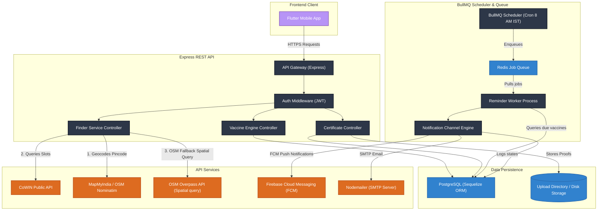
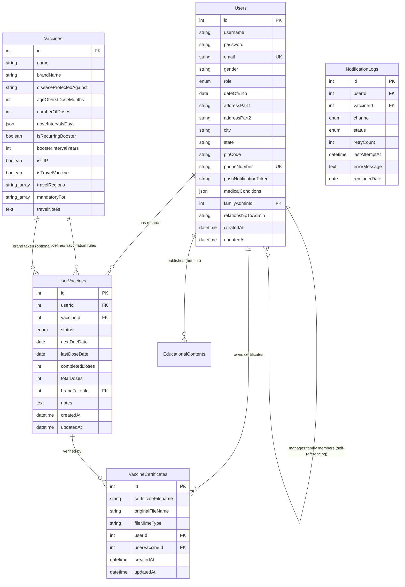
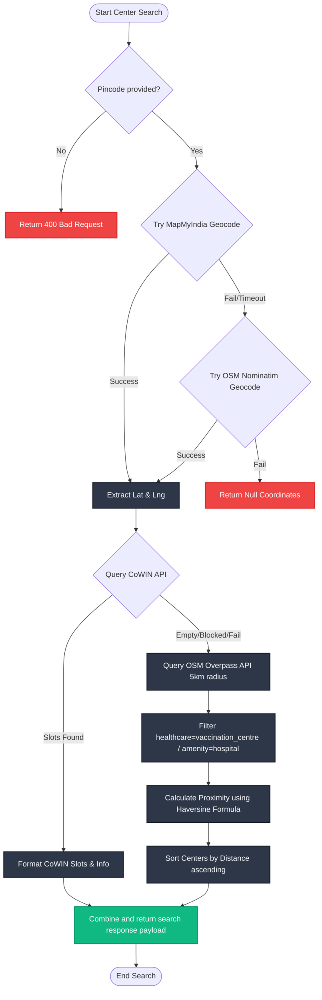

# 🛡️ VaccineVault

[](https://opensource.org/licenses/MIT)
[](https://expressjs.com/)
[](https://www.postgresql.org/)
[](https://redis.io/)
[](https://bullmq.io/)
[](https://flutter.dev/)

VaccineVault is a highly secure, production-grade immunization scheduler, record manager, and clinic locator built to streamline vaccination tracking for individuals and families. 

By integrating dynamic scheduling state machines, dual-engine spatial lookup services, biometrics authentication, and background alert pipelines, VaccineVault provides an institutional-grade digital immunization passport.

---

## ⚡ Technical Highlights & Key Capabilities

*   **Intelligent Immunization Scheduler State Machine**
    *   **Generic-to-Brand Dynamic Transition**: Initializes generic vaccine schedules based on age (universal pediatric guidelines). Upon recording the first dose, it prompts the user to select the specific brand (e.g., *Covishield* vs. *Covaxin*) and recomputes all future dose dates dynamically using brand-specific intervals.
    *   **Booster & Catch-up Engines**: Handles complex catch-up logic (retrospective logging), manual overrides, and schedules recurring boosters (e.g., annual influenza vaccine) dynamically.
    *   **Post-Exposure Prophylaxis (PEP) Engine**: Evaluates exposure categories (e.g., Rabies bite categories) and automatically provisions active WHO-compliant PEP schedules depending on whether the patient was previously immunized (2-dose vs. 4-dose schedules).
    *   **Travel Vaccination Planner**: Dynamically aggregates recommendations and entry requirements based on target travel regions (e.g., yellow fever certificates for parts of Africa or South America, Meningococcal requirements for Hajj).
*   **Dual-Engine Proximity Clinic Finder**
    *   **Fallback Geocoder**: Geocodes user pincodes using MapMyIndia API with automatic fallback to OpenStreetMap Nominatim API in case of limits or network failures.
    *   **Real-time Slot Registry & Spatial Fallback**: Queries CoWIN API for active vaccine slot availability. If CoWIN has no slots, it launches a spatial query to the OpenStreetMap Overpass API within a 5km radius to find all nearby hospitals and vaccination centers.
    *   **Geodesic Distance Sort**: Computes distance metrics on-the-fly using the Haversine formula and returns centers sorted by physical proximity.
*   **Decoupled Daily Alert Engine & Notification Scheduler**
    *   **Cron-triggered BullMQ Workers**: Schedules daily jobs at 08:00 AM IST via Redis queues. Decoupled worker processes query the database for pending or overdue records.
    *   **Guaranteed Notification Logs**: Implements persistent, idempotent notification logging. Every dispatch writes to a `NotificationLog` table to guarantee that a user receives exactly one notification per due vaccine per day across dual channels (SMTP email via Nodemailer & Firebase Cloud Messaging push alerts).
*   **Authorized Secure Certificate Vault**
    *   **Multipart Uploads**: Handles medical receipt and document uploads (PDF/Images) with disk validation.
    *   **IDOR Security Protection**: Download routes check ownership and self-referencing SQL family relationships to restrict downloads to the file owner or their verified family administrator.
*   **Multi-Profile Biometric Mobile Client**
    *   **Family Portal Support**: Supports profile management for dependents linked to a primary administrator account.
    *   **Local Biometric Auth**: Integrates fingerprint/face unlock via `local_auth`.
    *   **Offline Cache Security**: Utilizes `flutter_secure_storage` to keep session tokens protected locally.

---

## 📐 System Architecture

VaccineVault uses a distributed, microservices-ready structure with decoupled background workers. The frontend interacts with the REST API gateway, which coordinates core services, schedules async tasks through Redis, and stores relational data in PostgreSQL.



---

## 🗄️ Database Schema Design

The system implements a relational database structure designed with strict constraint mappings, indexes for query optimization, and cascade actions.



---

## 🧠 Core Engineering Algorithms

### 1. Dual-Engine Proximity Clinic Finder
The geocoder maps user requests to physical locations by prioritizing proprietary geographic data APIs and falling back to open-source servers. Proximity results are sorted using geodesic calculations.



### 2. Vaccine Brand Selection & Scheduling State Machine
This workflow handles the transition from a generic vaccine recommendation to a brand-specific, multi-dose scheduled tracker.

```mermaid
graph TD
    classDef state fill:#b794f6,stroke:#8b5fbf,stroke-width:2px,color:#fff;
    classDef check fill:#dd6b20,stroke:#c05621,stroke-width:2px,color:#fff;
    classDef final fill:#10b981,stroke:#059669,stroke-width:2px,color:#fff;

    Init([User Registration]) --> GetAge[Calculate age from dateOfBirth]
    GetAge --> RecommendGeneric[Generate generic userVaccine records: status=pending, doses=0, nextDueDate=DOB + ageOfFirstDoseMonths]:::state
    
    RecommendGeneric --> RecordFirstDose{User marks dose 1 as Taken?}:::check
    
    RecordFirstDose -- "Has Brand Options (e.g. COVID-19)" --> ReturnSelectBrand[API returns SELECT_BRAND status with available brands list]:::state
    RecordFirstDose -- "No Brands Available (e.g. BCG)" --> AutoScheduleGeneric[Directly compute next dose using generic template intervals]:::state
    
    ReturnSelectBrand --> UserChooseBrand[User selects brand from list]
    UserChooseBrand --> UpdateBrandFK[Link userVaccine to selected Vaccine Brand ID]:::state
    
    UpdateBrandFK --> ScheduleNextDose[Calculate nextDueDate = lastDoseDate + doseIntervalsDays[dose_index]]:::state
    AutoScheduleGeneric --> ScheduleNextDose
    
    ScheduleNextDose --> CompleteDosesCheck{Completed Doses >= totalDoses?}:::check
    
    CompleteDosesCheck -- No --> NextDosePending[Record remains status=pending, waits for next dose]:::state
    CompleteDosesCheck -- Yes --> BoosterCheck{isRecurringBooster=true & boosterIntervalYears > 0?}:::check
    
    BoosterCheck -- Yes --> ScheduleBooster[Schedule booster: nextDueDate = lastDoseDate + boosterIntervalYears, status=pending]:::state
    BoosterCheck -- No --> CompleteRecord[Mark record status=completed, nextDueDate=null]:::final
    
    NextDosePending --> RecordNextDose[User takes subsequent dose]
    RecordNextDose --> IncrementDoses[Increment completedDoses, lastDoseDate=today]
    IncrementDoses --> ScheduleNextDose
    
    ScheduleBooster --> UserTakesBooster[User takes booster dose]
    UserTakesBooster --> IncrementBoosterCount[Reset/Increment completedDoses, lastDoseDate=today]
    IncrementBoosterCount --> ScheduleBooster
```

---

## 📡 Key REST API Specification

### 1. Find Centers
Find nearby vaccination clinics and hospital locations with distance calculations and live details.

*   **Endpoint**: `GET /api/find/find-centers`
*   **Security**: Private (Bearer JWT required)
*   **Query Parameters**:
    *   `pinCode` (Required): 6-digit Indian postal code.
    *   `date` (Optional): Target date format `DD-MM-YYYY` (defaults to today).
    *   `userAddress` (Optional): Complete address string for geocode resolution.

**Response Example (OSM Fallback)**:
```json
{
  "search": {
    "pinCode": "110001",
    "date": "15-06-2026"
  },
  "userLocation": {
    "coordinates": {
      "lat": 28.6304,
      "lng": 77.2177
    },
    "source": "MapMyIndia"
  },
  "centers": [
    {
      "name": "Dr. Ram Manohar Lohia Hospital",
      "address": "Baba Kharak Singh Marg Connaught Place",
      "contact": "011-23365550",
      "vaccine": "Check Availability",
      "feeType": "Contact Hospital",
      "availableCapacity": 0,
      "distance": "1.23 km",
      "distanceValue": 1.2345,
      "source": "OpenStreetMap",
      "coordinates": {
        "lat": 28.6272,
        "lng": 77.2101
      }
    }
  ]
}
```

### 2. Update Vaccination Record
Record dose completions, trigger brand selection, and recalculate next due dates.

*   **Endpoint**: `PUT /api/vaccines/status/:userVaccineId`
*   **Security**: Private (Bearer JWT required)
*   **Request Body**:
```json
{
  "hasTaken": true
}
```

**Response Example (Brand Selection Triggered)**:
```json
{
  "message": "First dose recorded. Please select the brand to continue.",
  "action": "SELECT_BRAND",
  "brands": [
    {
      "id": 12,
      "name": "COVID-19 Vaccine",
      "brandName": "Covishield",
      "numberOfDoses": 2,
      "doseIntervalsDays": [84]
    },
    {
      "id": 13,
      "name": "COVID-19 Vaccine",
      "brandName": "Covaxin",
      "numberOfDoses": 2,
      "doseIntervalsDays": [28]
    }
  ],
  "updatedVaccine": {
    "id": 4,
    "status": "pending",
    "completedDoses": 1,
    "lastDoseDate": "2026-06-15",
    "nextDueDate": "2026-06-15"
  }
}
```

### 3. Create Situational Post-Exposure Prophylaxis Schedule
Instantiates a custom PEP routine based on exposure incidents.

*   **Endpoint**: `POST /api/vaccines/situational-schedule`
*   **Security**: Private (Bearer JWT required)
*   **Request Body**:
```json
{
  "exposureDate": "2026-06-15",
  "isPreviouslyImmunized": false,
  "exposureCategory": "Category III (Severe bite/scratch)"
}
```

**Response Example**:
```json
{
  "id": 8,
  "userId": 2,
  "vaccineId": 45,
  "status": "pending",
  "nextDueDate": "2026-06-15",
  "lastDoseDate": null,
  "completedDoses": 0,
  "totalDoses": 4,
  "notes": "{\"exposureDate\":\"2026-06-15\",\"category\":\"Category III (Severe bite/scratch)\"}",
  "createdAt": "2026-06-15T23:45:00.000Z",
  "updatedAt": "2026-06-15T23:45:00.000Z"
}
```

---

## 🛠️ Local Development & Orchestration

### Prerequisites
*   Node.js (v18+) & npm
*   PostgreSQL (v15+)
*   Redis (v7+)
*   Docker & Docker Compose (Optional)

### Environment Configurations
Create a `.env` file in the root directory:
```env
# Database Credentials
DB_NAME=vaccinevault
DB_USER=postgres
DB_PASSWORD=yourpassword
DB_HOST=localhost
DB_PORT=5432

# Cache & Queuing
REDIS_PORT=6379
REDIS_HOST=localhost

# Security Credentials
JWT_SECRET=your_jwt_signing_secret_key

# Third-Party API Integrations
MAPMYINDIA_CLIENT_ID=your_mapmyindia_client_id
MAPMYINDIA_CLIENT_SECRET=your_mapmyindia_client_secret
MAPMYINDIA_ACCESS_TOKEN=your_mapmyindia_access_token
MAPBOX_ACCESS_TOKEN=your_mapbox_access_token

# Notification Dispatch Credentials
EMAIL_USER=your_smtp_sender_email@gmail.com
EMAIL_PASS=your_smtp_app_password
BACKEND_PORT=5000
```

### Docker Compose Quickstart (Recommended)
Build and run the entire ecosystem (API, background queues, postgres, and redis) inside isolated containers:

```bash
# Build images and startup all services
docker-compose up --build

# Run in background daemon mode
docker-compose up -d

# View live container output logs
docker-compose logs -f
```

### Manual Service Bootstrapping
If you prefer running services directly on your host machine:

```bash
# 1. Clone the repository and navigate to root
cd VaccineVault

# 2. Setup PostgreSQL
createdb vaccinevault

# 3. Setup backend dependencies and databases
cd backend
npm install

# Run database migrations
npx sequelize-cli db:migrate
npx sequelize-cli db:seed:all

# 4. Spin up dev instances concurrently (API, workers, scheduler, and redis)
npm run dev
```

### Flutter Mobile App Execution
Ensure Flutter is installed and configured:

```bash
cd ../frontend

# Fetch Dart dependencies
flutter pub get

# Launch on connected simulator or hardware device
flutter run
```

---

## 🔒 Security Design Controls
1.  **Access Verification Tokens (JWT)**: Cryptographically signed tokens protect all state-modifying backend routes.
2.  **IDOR Mitigation checks**: Checks that the requesting `userId` matches the resource `userId` or is an authorized family administrator (`familyAdminId === requesterId`).
3.  **Strict File Mime Type Validation**: Certificate uploads verify extension formats and restrict uploads to PDFs or image formats before writing to disk.
4.  **Persistent Transaction States**: Relational DB modifications, such as brand assignment and scheduling date calculations, use transactional queries to maintain integrity.
5.  **Decoupled Worker Boundaries**: Heavy tasks (notification dispatching, geocoding fallback API queries) are separated from HTTP routes into BullMQ/Redis worker processes to maintain API responsiveness.
